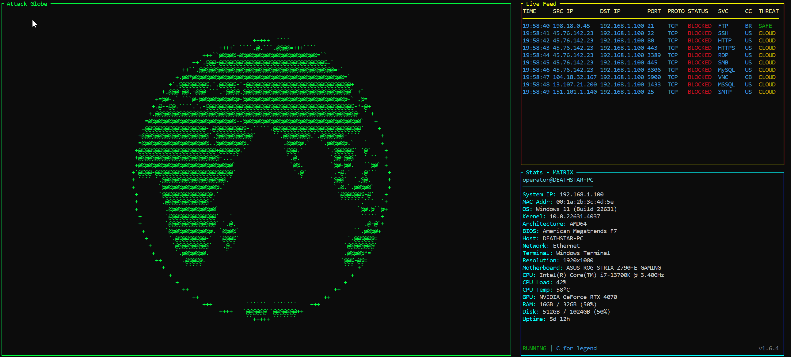

# DEATH STAR 💀⭐

**Real-time network attack visualization on a 3D ASCII globe with neofetch-style system info**

Monitor YOUR computer for incoming connection attempts, port scans, and firewall blocks - all displayed on a beautiful rotating 3D globe with smooth animations and vibrant colors.


Created by **ringmast4r** | **Version:** v1.6.4 ([SemVer](https://semver.org/))

---

## 📸 Preview



---

## 🎯 What Does This Do?

**DEATH STAR monitors YOUR computer** with a stunning terminal dashboard featuring:

- 💀 **Death Star Mode** - Toggle between spinning globe and static Death Star ASCII art
- 🌍 **3D Spinning ASCII Globe** - Smooth 30 FPS rotation with lighting effects
- 📊 **Live Attack Feed** - Real-time display of blocked connections with IP geolocation and threat intelligence
- 🔒 **Port Scan Detection** - Automatically detects 5+ ports scanned within 60 seconds
- 🌐 **IPv6 Support** - Full support for IPv6 addresses (link-local, localhost, unique local)
- 💻 **Enhanced System Info** - Shows OS, Architecture, BIOS, CPU, GPU, CPU Load/Temp, RAM, Disk, Battery, Network type, and more
- 🎨 **7 Beautiful Themes** - Matrix, Amber, Nord, Dracula, Mono, Rainbow, and Skittles
- 🌈 **16-Color Skittles Mode** - Fully randomized candy colors across the globe
- ⚡ **Flicker-Free Rendering** - Using blessed library for smooth 30 FPS terminal control
- 🎮 **Interactive Controls** - Death Star toggle, theme switching, lighting effects, pause, and plus mode
- 🖥️ **Cross-platform** - Works on Windows and Linux

---

## 🛡️ Educational & Defensive Security Tool

**DEATH STAR is a 100% defensive, educational, open-source security tool.**

### Purpose & Ethics

This tool is designed **exclusively** for:
- ✅ **Monitoring YOUR OWN computer** - Visualize firewall blocks on your system
- ✅ **Educational purposes** - Learn about network security, port scans, and attack patterns
- ✅ **Defensive security** - Understand what threats target your network
- ✅ **Security awareness** - Help non-technical users understand network traffic
- ✅ **Open-source learning** - Study real-time log parsing and data visualization

### What This Tool Does (and Doesn't Do)

**✅ DOES:**
- Reads firewall logs from **YOUR computer only**
- Displays blocked connection attempts in real-time
- Provides educational context about network protocols and services
- Helps you understand what's targeting your system
- All data stays **100% local** - nothing is uploaded or shared

**❌ DOES NOT:**
- Attack, scan, or probe other systems
- Collect credentials or sensitive data
- Perform any offensive security actions
- Access other people's networks or systems
- Send any data outside your computer

### Privacy & Security Principles

- 🔒 **Read-only access** - Only reads existing firewall logs, never modifies anything
- 🏠 **100% local** - All processing happens on your computer
- 🔐 **No telemetry** - No tracking, analytics, or data collection
- 📖 **Open source** - Full transparency, audit the code yourself
- 🎓 **Educational first** - Built to teach, not to exploit

### Legal & Responsible Use

**This tool should ONLY be used:**
- On systems **you own** or have **explicit permission** to monitor
- For **learning** about network security and defensive practices
- To **understand** what threats exist in the real world
- As a **visualization tool** for your own firewall logs

**Misuse Policy:**
- The developers **do not support** any malicious or unauthorized use
- Using this tool to monitor networks you don't own is **illegal and unethical**
- This tool is for **defense and education**, not offense

### For Security Researchers & Educators

DEATH STAR is an excellent tool for:
- Teaching students about network protocols and firewall behavior
- Demonstrating real-world attack patterns in a safe, controlled environment
- Explaining IPv4/IPv6 addressing, port scanning, and threat assessment
- Visualizing abstract security concepts with real-time data
- Workshops on defensive security and incident response

**By using this tool, you agree to use it responsibly and ethically.**

---

## ✨ Latest Features (v1.6.2)

### Clean Repository Structure 🎯 **NEW!**
- **Minimal Footprint** - GitHub repository contains only files needed by end users
- **6 Essential Files** - Just the executable, source code, docs, and testing tools
- **No Clutter** - Developer tools (build scripts, signing tools) kept local only
- **Easy Access** - Download and run without confusion

### Performance Improvements 🚀 (v1.6.1)
- **5x Faster Live Feed** - Reduced polling from 50ms to 10ms for near-instant updates
- **Real-time Responsiveness** - Entries appear within 10-20ms of being logged
- **Optimized for Speed** - Minimal CPU impact while maximizing detection speed

### Attack Data Logging 📊 **NEW!**
- **Automatic CSV Logging** - Saves all attack data to `logs/` directory
- **Daily Rotation** - New file each day: `attacks_YYYY-MM-DD.csv`
- **12 Data Columns** - Timestamp, IPs, Port, Protocol, Service, Country, City, ISP, Threat Level, Attack Type, Action
- **Excel Compatible** - Open directly in Excel or Google Sheets
- **Thread-Safe** - No performance impact on dashboard
- **Privacy First** - All data stays on your computer

Example log file:
```csv
Timestamp,Source_IP,Dest_IP,Port,Protocol,Service,Country,City,ISP,Threat_Level,Attack_Type,Action
2025-10-05 15:30:22,45.76.142.23,10.0.0.226,22,TCP,SSH,US,New York,DigitalOcean,CLOUD,PROBE,DROP
```

### Enhanced Operator Mode 🎯 (v1.5.0)
- **Press 'O' for Detailed Analysis** - Educational panel explains what you're seeing
- **IP Type Identification** - Explains IPv6 Link-Local, Multicast, Private IPs, Public IPs
- **Service Descriptions** - Detailed info on common ports (mDNS, SSH, RDP, SMB, HTTP, etc.)
- **Smart Verdicts** - Tells you if traffic is normal/harmless or potentially malicious
- **Educational Context** - Explains what each service does, why it's blocked, and common uses
- **Perfect for Non-Technical Users** - Translates technical network data into plain language

Example Analysis:
```
SOURCE IP: fe80::b622:82ab:8074:9290
  Type: IPv6 Link-Local
  Meaning: A device on your local network (not internet)
  Assessment: Safe - Private network device

TARGET PORT: 5353 (mDNS - Multicast DNS)
  Purpose: Device discovery on local networks
  Common Uses: Printers, Apple devices (AirPlay/AirDrop), smart home
  Why Blocked: Windows Firewall blocks multicast by default

VERDICT:
  This is NORMAL, HARMLESS local network traffic.
  Your devices are doing routine network discovery.
  Not an attack - just standard network operations.
```

---

## ✨ Core Features

### Enhanced Globe Rendering
- **Smooth 20 FPS Animation** - Optimized for performance and smooth rotation
- **50-second rotation period** - Complete revolution every 50 seconds (adjustable)
- **ASCII Character Progression** - Full gradient: @ → # → % → o → = → + → - → . → `
- **Lighting Effects** - Optional dimming/shading effect (toggle with 'L')
- **Plus Mode** - Simplified rendering with '+' characters (toggle with 'P')
- **Anti-aliasing** - Boosted density for sharper symbols and better land/ocean contrast
- **Skip Animation** - Press Enter during startup to skip intro animation

### Vibrant Color Themes
- **Rainbow Mode** - 7-color spectrum with fluorescent RGB values
- **Skittles Mode** - 16 vibrant candy colors with pseudo-random distribution
- **No Color Banding** - Fixed solid cyan/purple rows with proper randomization
- **True RGB Colors** - Direct ANSI escape codes for Windows 10+ VT100 support

### Death Star Mode
- **Static ASCII Art** - Beautiful Death Star visualization with superlaser dish detail
- **Dynamic Scaling** - Automatically sizes to match globe dimensions
- **Theme Support** - Works with all 7 color themes including Rainbow and Skittles
- **Lighting Effects** - Press 'L' to dim/brighten the Death Star
- **Seamless Toggle** - Press 'D' to switch between Death Star and Globe instantly

### Enhanced Stats Panel
- **Expanded System Info**:
  - OS (Windows 10/11 build, Linux distro)
  - Architecture (x64, ARM64, etc.)
  - BIOS Version
  - Hostname
  - Network Type (WiFi/Ethernet)
  - Terminal Type (Windows Terminal, CMD, PowerShell, etc.)
  - Screen Resolution
  - Motherboard
  - CPU model
  - CPU Load (real-time percentage)
  - CPU Temperature (if available)
  - GPU model (NVIDIA GeForce RTX, Intel UHD, etc.)
  - RAM (Total / Used with percentage)
  - Disk (Total / Used with percentage)
  - Battery (percentage, status, time remaining - laptops only)
  - System Uptime
- **Clean Layout** - User@Host header with system details below

### Interactive Controls
- **D** - Toggle Death Star mode (switch between globe and Death Star)
- **O** - Toggle Operator Mode (detailed analysis with IP/service explanations)
- **T** - Cycle through 7 themes (instant switching)
- **L** - Toggle lighting/dimming effect on/off
- **P** - Toggle plus mode (simplify rendering)
- **A** - Toggle Attack Details panel (show detailed info on latest attack)
- **Space** - Pause/Resume globe rotation
- **C** - Toggle control legend
- **Enter** - Skip startup animation (during intro only)
- **Q** or **Ctrl+C** - Exit

---

## 🚀 Quick Start

### Prerequisites

- Python 3.7 or higher
- Windows 10/11 with Firewall logging enabled **OR** Linux with UFW/iptables

### Option 1: Run the Executable (Recommended)

**Build the EXE once:**
```bash
# Navigate to DEATH STAR folder
cd DEATH_STAR

# Install build dependencies
pip install -r requirements-build.txt

# Build executable (creates dist\DEATH_STAR.exe)
build.bat
```

**Run the EXE:**
1. Double-click `dist\DEATH_STAR.exe`
2. Click **"Yes"** when Windows UAC prompts for admin rights
3. The dashboard launches with full firewall log access!

**Why admin rights?** Windows firewall logs are stored in `C:\Windows\System32\LogFiles\` which requires administrator privileges to read.

### Option 2: Run Python Script

```bash
# Navigate to DEATH STAR folder
cd DEATH_STAR

# Install dependencies
pip install blessed psutil

# Run the dashboard
python dashboard.py --theme matrix
```

**Note:** When running the Python script directly, you'll need to run your terminal as Administrator to access real firewall logs. Otherwise, use `--demo` mode for simulated traffic.

### Windows: Enable Firewall Logging

DEATH STAR needs Windows Firewall logging enabled to monitor real attacks:

#### **From Windows Security:**

1. Open **Windows Security** (search in Start menu)
2. Click **Firewall & network protection**
3. Click **"Advanced settings"** (blue link on left side)
   - This opens "Windows Defender Firewall with Advanced Security"

#### **In Advanced Security Window:**

4. **Right-click** on **"Windows Defender Firewall with Advanced Security on Local Computer"**
   - This is at the top of the left sidebar tree
5. Select **"Properties"** from the context menu

#### **In Properties Dialog:**

You'll see tabs for: **Domain Profile**, **Private Profile**, **Public Profile**

**For EACH of these 3 tabs, do the following:**

6. Click the tab (Domain, then Private, then Public)
7. Scroll down to find the **"Logging"** section (near the bottom)
8. Click the **"Customize..."** button
9. In the "Customize Logging Settings" window:
   - Find **"Log dropped packets"**
   - Change it from **"No"** to **"Yes"**
   - (Optional) Set **"Log successful connections"** to "Yes" for more data
10. Click **"OK"**
11. **Repeat steps 6-10 for all 3 profiles** (Domain, Private, Public)
12. Click **"Apply"**, then **"OK"** to close Properties

#### **Quick Shortcut:**

Press `Win + R`, type `wf.msc`, press Enter - opens Advanced Security directly

#### **Verify Logging is Working:**

After enabling, wait a few minutes then check:
```cmd
dir C:\Windows\System32\LogFiles\Firewall\pfirewall.log
```

If the file exists with size > 0 KB, logging is active!

Default log location: `C:\Windows\System32\LogFiles\Firewall\pfirewall.log`

### Linux: Enable Firewall Logging

DEATH STAR supports both UFW and iptables on Linux. Choose the section for your firewall:

#### **For UFW (Ubuntu/Debian/Linux Mint):**

UFW (Uncomplicated Firewall) is the default on Ubuntu-based systems.

1. **Enable UFW logging:**
```bash
# Enable UFW logging
sudo ufw logging on

# Set logging level (optional - 'low', 'medium', 'high', 'full')
sudo ufw logging medium
```

2. **Verify UFW is active and logging:**
```bash
# Check UFW status
sudo ufw status verbose

# Should show: Logging: on (medium)
```

3. **Check log file location:**
```bash
# UFW logs to /var/log/ufw.log
ls -lh /var/log/ufw.log

# View recent entries
sudo tail -20 /var/log/ufw.log
```

#### **For iptables (RHEL/CentOS/Fedora/Arch):**

1. **Add logging rule to iptables:**
```bash
# Log dropped packets (INPUT chain)
sudo iptables -I INPUT -j LOG --log-prefix "[FIREWALL DROP] " --log-level 4

# Make rule persistent (Ubuntu/Debian)
sudo iptables-save | sudo tee /etc/iptables/rules.v4

# Make rule persistent (RHEL/CentOS)
sudo service iptables save
```

2. **Configure rsyslog to separate firewall logs (optional but recommended):**
```bash
# Create rsyslog config for firewall
echo ':msg, contains, "[FIREWALL DROP]" /var/log/iptables.log' | sudo tee /etc/rsyslog.d/10-iptables.conf

# Restart rsyslog
sudo systemctl restart rsyslog
```

3. **Verify logging:**
```bash
# Check kernel log
sudo tail -f /var/log/kern.log | grep FIREWALL

# Or check dedicated iptables log (if configured above)
sudo tail -f /var/log/iptables.log
```

#### **Running DEATH STAR on Linux:**

```bash
# Navigate to DEATH STAR folder
cd DEATH_STAR

# Install dependencies
pip install blessed psutil

# Run with sudo to access firewall logs
sudo python dashboard.py --theme matrix

# Specify custom log path (if needed)
sudo python dashboard.py --log-path /var/log/ufw.log

# Or run in demo mode (no sudo needed)
python dashboard.py --demo
```

#### **Linux Log Locations:**

- **UFW:** `/var/log/ufw.log`
- **iptables (kernel log):** `/var/log/kern.log`
- **iptables (custom):** `/var/log/iptables.log` (if configured)

#### **Quick Verification:**

After enabling logging, generate test traffic:
```bash
# Try to access a blocked port (will be logged)
telnet localhost 23

# Check if it appears in logs
sudo tail /var/log/ufw.log
# or
sudo tail /var/log/kern.log | grep FIREWALL
```

#### **Demo Mode (No Firewall Logs Needed):**

Want to see DEATH STAR in action immediately? Use demo mode:
```bash
python dashboard.py --demo
```
This simulates live attack traffic without requiring firewall logs.

#### **Screenshot Demo Mode (For README Photos):**

Need to take screenshots for documentation? Use screenshot demo mode:
```bash
python dashboard.py --demo-screenshot
```

**What it does:**
- Immediately populates feed with 17 diverse fake attacks (no waiting!)
- Shows all threat levels: CLOUD (yellow), HOSTING (red), SAFE/ISP (green)
- Includes port scan example (same IP hitting 6+ ports)
- Displays various countries: US, CN, RU, DE, NL, FR, GB, BR
- Shows different services: SSH, RDP, HTTP, MySQL, SMB, Telnet, VNC, etc.
- **NEW:** Masks ALL real system stats with fake data (v1.6.4)
  - Fake hostname: `DEATHSTAR-PC`
  - Fake username: `operator`
  - Fake IP: `192.168.1.100`
  - Fake MAC: `00:1a:2b:3c:4d:5e`
  - Fake hardware specs (CPU, GPU, RAM, etc.)
- Perfect for taking clean screenshots without exposing ANY real data

#### **Test Script (Generate Real Firewall Logs):**

Want to test with real firewall log entries? Use the included test script:

**Right-click `test_firewall.bat` → "Run as Administrator"**

⚠️ **Requires Admin Privileges** - The script temporarily creates firewall rules

**How it works:**
1. Creates temporary outbound block rules via Windows Firewall
2. Attempts connections to those ports (which get blocked and logged)
3. Automatically cleans up all temporary rules

**What it generates:**
- ✅ 15 real blocked firewall log entries
- ✅ Common attack ports (SSH, RDP, SMB, MySQL, VNC, MSSQL, FTP, Telnet, etc.)
- ✅ Port scan pattern (5+ ports from same IP 45.76.142.23)
- ✅ Both TCP and UDP protocols
- ✅ Entries show in DEATH STAR within 5-10 seconds

**Perfect for:**
- Testing the Live Feed in real-time
- Demonstrating DEATH STAR features
- Verifying firewall logging is working

---

## 💻 Usage

### Basic Usage

```bash
# Default matrix theme
python dashboard.py

# Demo mode with simulated attack traffic
python dashboard.py --demo

# Skittles candy theme with 16 random colors
python dashboard.py --theme skittles

# Rainbow spectrum theme
python dashboard.py --theme rainbow

# Custom rotation speed (default 50 seconds)
python dashboard.py --rotation 60

# Combine demo mode with themes
python dashboard.py --demo --theme dracula

# Screenshot demo mode (for taking photos)
python dashboard.py --demo-screenshot --theme matrix
```

### Command-Line Options

```
--theme {matrix,amber,nord,dracula,mono,rainbow,skittles}
    Color theme (default: matrix)

--rotation SECONDS
    Globe rotation period in seconds (default: 50)

--log-path PATH
    Custom firewall log file path (auto-detected if not specified)

--demo
    Enable demo mode with simulated attack traffic
    Perfect for testing without real firewall logs

--demo-screenshot
    Enable screenshot demo mode with immediate diverse fake data
    17 pre-loaded attacks showing all features
    Masks ALL system stats (hostname, IP, MAC, hardware specs)
    Perfect for taking README photos without exposing real data
```

### Themes

- **matrix** - Classic green hacker aesthetic 🟢
- **amber** - Retro CRT orange 🟠
- **nord** - Cool Scandinavian cyan 🔵
- **dracula** - Dark with magenta accents 🟣
- **mono** - Monochrome white on black ⚪
- **rainbow** - 7-color fluorescent spectrum 🌈
- **skittles** - 16 vibrant candy colors 🍬

---

## 🎨 Dashboard Layout

```
┌─────────────────────────────────────┬──────────────────────────────────────────────────┐
│      Attack Globe / Death Star      │ Live Feed                                        │
│                                     │                                                  │
│  Rotating 3D ASCII Globe (press D)  │  TIME     SRC IP        DST IP        PORT  PROTO  STATUS   SVC      │
│    OR Static Death Star Display     │  ──────────────────────────────────────────────────────────────────  │
│                                     │  14:23:45 203.0.113.45  10.0.0.226    22    TCP    BLOCKED  SSH      │
│     @ = Land (high density)         │  14:23:46 198.51.100.8  10.0.0.226    3389  TCP    BLOCKED  RDP      │
│     # = Land (medium)               │  14:23:47 203.0.113.45  10.0.0.226    445   TCP    BLOCKED  SMB      │
│     + = Land (low) / Plus mode      │  14:23:48 10.0.0.251    10.0.0.226    5353  UDP    BLOCKED  mDNS     │
│     - = Ocean                       │  14:23:49 192.0.2.156   10.0.0.226    8080  TCP    BLOCKED  HTTP-AL  │
│     * = Attack markers              │                                                  │
│                                     ├──────────────────────────────────────────────────┤
│  [D] Death Star  [T] Theme          │ Stats - MATRIX                                   │
│  [L] Lighting    [P] Plus           │                                                  │
│  [Space] Pause   [C] Legend         │  Squir@DESKTOP-PC                                │
│                                     │  ───────────────                                 │
│                                     │  System IP: 10.0.0.128                           │
│                                     │  MAC Addr: 84:11:45:...                          │
│                                     │  OS: Windows 10                                  │
│                                     │  Architecture: AMD64                             │
│                                     │  CPU: Intel i7-9700K                             │
│                                     │  CPU Load: 2.7%                                  │
│                                     │  GPU: RTX 3070                                   │
│                                     │  RAM: 8GB / 32GB (25%)                           │
│                                     │  Battery: 99% (Charging)                         │
│                                     │  RUNNING | C for legend                   v1.6.2 │
└─────────────────────────────────────┴──────────────────────────────────────────────────┘
```

### Live Feed Columns

- **TIME** - Timestamp of the connection attempt (HH:MM:SS)
- **SRC IP** - Source IP address attempting the connection (max 13 chars, truncated if longer)
- **DST IP** - Destination IP (your machine's IP being targeted, max 13 chars)
- **PORT** - Destination port being targeted
- **PROTO** - Protocol (TCP, UDP, ICMP)
- **STATUS** - Connection status (color-coded)
  - 🔴 **BLOCKED** - Connection dropped by firewall (red)
  - 🟢 **ALLOWED** - Connection permitted by firewall (green) *[future feature]*
- **SVC** - Identified service (max 7 chars, e.g., SSH, RDP, NetBIOS, HTTP-AL)
- **CC** - Country code (2-letter ISO code)
- **THREAT** - Threat assessment (SAFE/ISP, CLOUD, HOSTING, LOCAL, UNKNOWN)
  - 🟢 **SAFE/ISP** - Residential/ISP connections (green)
  - 🟡 **CLOUD** - Cloud providers (AWS, Azure, GCP) - yellow
  - 🔴 **HOSTING** - Hosting/VPS providers - red
  - ⚪ **LOCAL** - Private network IPs
  - ⚪ **UNKNOWN** - Unclassified

### Attack Details Panel

Press **A** to toggle detailed information about the most recent attack:

```
┌─ Attack Details ─────────────────────────┐
│ IP Address: 203.0.113.45                 │
│ Location: Beijing, China (CN)            │
│ ISP/Org: China Telecom                   │
│                                          │
│ Target Port: 22 (SSH)                    │
│ Protocol: TCP                            │
│ Timestamp: 2025-10-05 14:23:45          │
│                                          │
│ Threat Level: HOSTING                    │
│ Attack Type: PROBE                       │
│ Attempts: 3                              │
│                                          │
└──────────────────────────────────────────┘
         Press [A] to close
```

---

## 🛠️ Technical Implementation

### Globe Rendering
- **blessed library** - Smooth terminal control (like Go's tcell)
- **ANSI RGB escape codes** - Direct color codes `\033[38;2;R;G;Bm` for true color
- **VT100 terminal mode** - Windows console mode 7 for ANSI support
- **3D projection** - Equirectangular to sphere mapping
- **120x60 Earth bitmap** - Character map for land/ocean data
- **Double buffering** - Build entire frame before single write

### Lighting System
- **Lambertian shading** - Physically-based diffuse lighting
- **Light follow mode** - Sun rotates opposite to globe at 23.5° tilt
- **Minimum ambient** - 0.2 ambient light prevents pure black shadows
- **Surface normals** - 3D vector math for proper shading

### Color System
- **Direct RGB values** - Matching Go implementation exactly
- **Skittles hashing** - Prime number multipliers for pseudo-random distribution
- **16-bit color index** - Values 1-16 for skittles, 0-6 for rainbow

### System Info & Performance
- **psutil** - Cross-platform system/hardware info
- **subprocess + wmic** - Windows GPU detection
- **platform module** - OS and CPU info
- **Neofetch-inspired** - Clean stats display matching neofetch output
- **Background caching** - System info updated every 2 seconds in separate thread
- **Lightning-fast controls** - Instant theme switching and interaction response

---

## 📊 What Data is Monitored?

DEATH STAR monitors **dropped/blocked connections** from your firewall:

### Windows Firewall
- Parses: `C:\Windows\System32\LogFiles\Firewall\pfirewall.log`
- Shows: Blocked incoming connection attempts

### Linux Firewalls
- **UFW**: `/var/log/ufw.log`
- **iptables**: `/var/log/iptables.log` or `/var/log/kern.log`

**What you see:**
- Source IP addresses trying to connect
- Destination ports they're targeting (SSH, RDP, HTTP, etc.)
- Geographic origin (country, city)
- Connection protocol (TCP, UDP, ICMP)
- Live feed with username and password attempts

---

## 🔒 Privacy & Security

- **No data leaves your computer** - Everything runs locally
- **Read-only** - Only reads firewall logs, never modifies anything
- **No telemetry** - No tracking, analytics, or phone-home

---

## 📝 Dependencies

### Runtime Dependencies
```
blessed      - Terminal control and formatting
psutil       - System and hardware information
platform     - OS detection
subprocess   - GPU detection (Windows)
```

Install with:
```bash
pip install -r requirements.txt
```

### Build Dependencies (for creating EXE)
```
pyinstaller  - Convert Python script to executable
```

Install with:
```bash
pip install -r requirements-build.txt
```

---

## 🙏 Credits

- **ringmast4r** - Creator and maintainer
- **SecKC-MHN-Globe** - Original Go implementation for globe rendering algorithms
- **dylanaraps/neofetch** - System info display inspiration
- **blessed library** - Beautiful terminal control for Python
- **psutil** - Cross-platform system information

---

## 📜 License

BSD 2-Clause License - Copyright (c) 2025, ringmast4r

See [LICENSE](LICENSE) file for full text.

---

## 🤝 Contributing

Contributions welcome! Feel free to:

- Report bugs
- Suggest features
- Submit pull requests
- Share your custom themes

---

## ❓ FAQ (Frequently Asked Questions)

### Q: Does DEATH STAR log or save attack data?
**A:** YES! (As of v1.6.0) DEATH STAR automatically saves all attack data to CSV files.

- **Reads from:** Windows Firewall logs (`C:\Windows\System32\LogFiles\Firewall\pfirewall.log`)
- **Saves to:** `logs/` directory in CSV format
- **File naming:** `attacks_YYYY-MM-DD.csv` (one file per day)
- **Auto-rotation:** New file created automatically each day at midnight
- **Privacy:** All data stays on your computer - nothing is uploaded

**CSV includes 12 columns:**
- Timestamp, Source IP, Dest IP, Port, Protocol, Service
- Country, City, ISP, Threat Level, Attack Type, Action

**Example:** `logs/attacks_2025-10-05.csv`

Open in Excel, Google Sheets, or import into your favorite database for analysis!

### Q: Why does the exe show "Unknown Publisher"?
**A:** This is normal and safe - DEATH STAR uses a self-signed certificate.

When you run DEATH_STAR.exe, Windows shows a UAC prompt that says "Unknown Publisher." This happens because:

- The exe is signed with a self-signed certificate (not from a commercial Certificate Authority)
- Windows only recognizes certificates from trusted CAs like Verisign, DigiCert, etc.
- Self-signed certificates are perfectly safe for personal use, but Windows can't verify the publisher

**Is it safe?**
Yes! This is standard for open-source software. You can verify the exe is legitimate by:
- Downloading only from the official GitHub repository
- Checking the file hash matches the release
- Building from source yourself if you prefer

**Note:** You can click "Yes" on the UAC prompt to run the software. The "Unknown Publisher" warning is cosmetic and doesn't affect functionality.

### Q: I pressed '1' to continue without firewall logs and it crashed. Why?
**A:** This was a bug in v1.5.0, **fixed in v1.5.1**.

- **Old behavior (v1.5.0):** Pressing '1' tried to run without data → crash
- **New behavior (v1.5.1):** Pressing '1' automatically enables demo mode → works fine

Update to v1.5.1 or later to fix this issue.

### Q: The test_firewall.bat script doesn't generate logs. Why?
**A:** Windows Firewall might not be logging outbound blocked connections.

**Check these settings:**
1. Open `wf.msc` (Win+R → type `wf.msc` → Enter)
2. Right-click "Windows Defender Firewall with Advanced Security"
3. Select "Properties"
4. For **each profile** (Domain, Private, Public):
   - Click the profile tab
   - Find "Logging" section → Click "Customize..."
   - Set "Log dropped packets" to **YES**
   - Click OK
5. Click Apply → OK

**Note:** By default, Windows Firewall allows outbound connections, so the test script creates temporary block rules to generate log entries.

### Q: Why is firewall logging "inactive" even though my firewall is on?
**A:** DEATH STAR checks for recent log entries (within last 5 minutes).

- If your firewall is on but hasn't blocked anything recently → shows "inactive"
- This is normal if you have no current attack traffic
- Run `test_firewall.bat` as admin to generate test entries
- Or use `--demo` mode to see simulated traffic

### Q: Why do firewall log entries take 30-60 seconds to appear?
**A:** This is normal Windows Firewall behavior - NOT a DEATH STAR bug.

**What's happening:**
- Windows Firewall batches log writes for performance (30-60 second intervals)
- Test script creates entries immediately, but Windows delays writing them to the log file
- DEATH STAR detects and displays entries within 10-20ms once Windows writes them

**How to test properly:**
1. Start DEATH_STAR.exe (keep it running)
2. Run test_firewall.bat as admin in another terminal
3. **Wait 30-60 seconds** - entries will appear all at once
4. Real attacks show up normally (ongoing traffic triggers more frequent writes)

**This is a Windows limitation** - log batching is hardcoded and cannot be disabled.

---

## ⚡ Roadmap

- [x] Smooth 3D globe rendering
- [x] Exact Go implementation lighting
- [x] Rainbow and Skittles themes
- [x] Neofetch-style system info
- [x] Export attack data to CSV (v1.6.0)
- [ ] Live packet capture mode
- [ ] JSON export for integration
- [ ] Web dashboard interface
- [ ] Alert notifications for high-volume attacks
- [ ] Historical attack playback from logs

---

Built with ❤️ by ringmast4r | *Stay safe out there!* 🛡️
